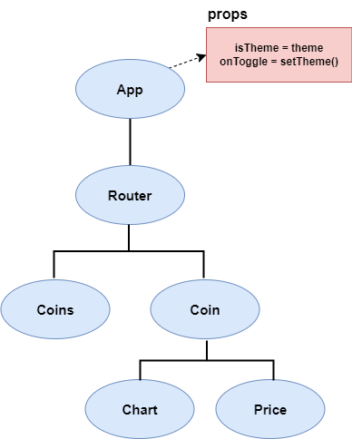

### 개요

- 저번 주에 진행했던 Side Project인 `Crypto Tracker`에서
- `Theme(Light-Dark)` 전환하는 `Toggle Button` 구현했었는데
- 테마 전환 기능의 요점은 특정 페이지에서 테마를 바꾸면
- 변동 사항이 다른 페이지에도 똑같이 적용돼야 한다는 것이다.

- 이를 위해서 최상위 컴포넌트, `App`에서 `theme`의 상태(`state`) 설정하고
- `props` 통해서 하위 컴포넌트에게 `theme` 상태를 전달하였다.
- 그리고 이를 통해서 `Crypto-Tracker`, `Main Home (coins.tsx)`에서
- `theme` 바꾸면 다른 페이지인 `Coin Detail (coin.tsx)`에서도
- `Main Home`에서 바꾼 테마가 동일하게 유지된다.



---

- 여기서 `theme`은 `App - Router - (Coins/Coin)` 순으로 전달되는데
- `theme` 참조해서 테마를 바꾸는 건 `coins, coin` 뿐이다.

- `theme`은 `<App/>`, `<Router/>`에선 사용되지 않기에
- `theme` 입장에서 이 두 Component는 그저 지나가는 중간 다리에 불과하다.

- 이런 식으로 중간 다리를 거치지 않고, `theme`의 `value` 따로 보관하다가
- `theme`이 필요한 `<Coins/>`, `<Coin/>`에 직접적으로 전달하고 싶다..
- 이럴 때 활용할 수 있는 것이 `state-management program`이다.

- `React`에서 `state` 관리할 때 쓰는 `Library`로는
- `Redux`, `Recoil`, `Zustand` 등 여러가지가 존재하지만
- 강의에선 `Recoil` 사용해서 `state` 관리하기 때문에
- `Recoil`만을 다룰 예정이다.

---

### `Recoil`

- `Facebook(Meta)`에서 개발한 상태 관리 라이브러리
- `Recoil Package`는 `npm`에 포함되는데, 아래 명령어를 입력해서
- 현재 프로젝트에 `Recoil` 설치할 수 있다.

``` shell
npm install recoil
```

---
#### `Atom`

- 상태 관리 라이브러리를 사용하면, 앞에서 설명했던
- `App - Router - Coin - Chart/Price` 순으로 공유할 필요가 없다.

- `Recoil`에선 이러한 `state`를 (여러 Component 참조하는 `state`)
- `Atom`이라는 것에 보관한다. (일종의 `state` 저장소)

- `Atom`에는 `state`의 일부가 보관되고
- `Atom`에 보관된 `state`는 어떤 Component에서나 읽고, 쓸 수 있다.

- [Next Parts / Crypto-Tracker에 recoil 설치, props tree 수정](/FrontEnd/React/React_masterclass/State-management/Recoil_Update_in_Crypto-Tracker.md)

---

