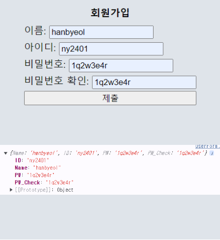
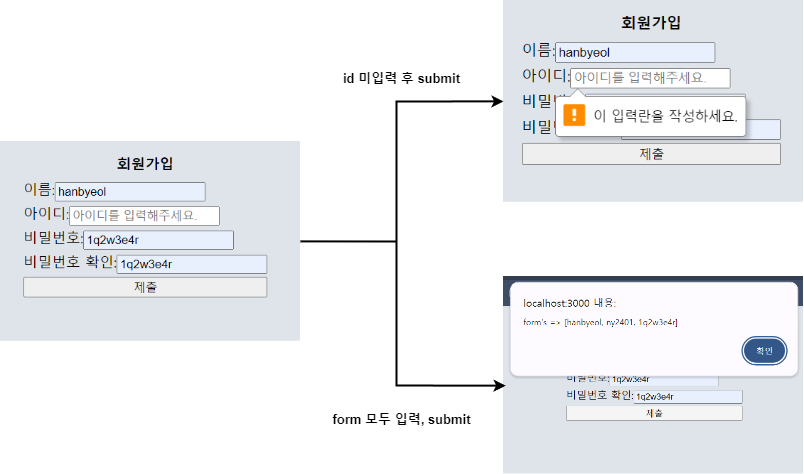
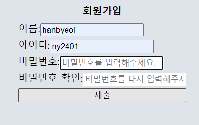
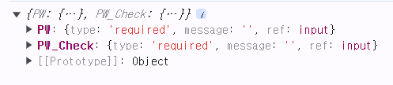

## `React Hook Form`

### 개요

- `React Form` 예제에서 일정 입력 `form`에 일정을 입력하지 않은 상태에서
- `[추가]` 버튼을 눌렀을 때 Error 메시지를 출력하는
- `Form Error` 검증 코드를 아래와 같이 추가하였다.

``` tsx
const [ToDoError, setToDoError] = useState("");

const onSubmit = (event: React.FormEvent<HTMLFormElement>) => {
	event.preventDefault();
	if(ToDo.length < 2){
		setToDoError("입력하신 일정을 확인해주세요. (최소 두 글자 이상)")
		setToDo("");
	} else {
		console.log(`Submit / 추가한 일정: ${ToDo}`);
	}
};

return (
	/*기존 코드..*/
	<div>
		{ToDo == "" ? ToDoError : null}
	</div>
);
```

- 일정 입력 `Form`에 관한 `Error` 여부를 관리할 `state` 추가하였다.
- 입력한 일정이 두 글자 이하인 경우에 아래 이미지처럼 <br/>
	`Error` 여부를 관리하는 `state`에 특정 문자열 값을 전달하고
- 이를 아래 이미지처럼 웹 페이지에 출력한다.


- `To Do List`의 일정 입력 `form`에 `Error` 검증 코드 작성을 완료하였다.

- 이제 새로운 상황을 가정해보자.
- 예를 들어서 내가 한 웹 사이트에서, 회원 가입 기능을 개발한다고 가정해보자.
- 이때 사용자로부터 입력 받을 데이터는 다음과 같다.

```
- 이름
- 아이디
- 비밀번호
- 비밀번호 확인
```

- 이렇게 입력 받은 데이터들을 `state` 통해서 관리하는데...
- 이 외에도 각 입력 `form`에 데이터 기입 여부도 `state`로 관리한다고 하면
- 대략적으로 8개 정도의 `state`를 만들어야 한다.

- 그리고 각 `Error`에 대한 검증 코드도 데이터 별로 따로 만들어 줘야 한다.
- 다소 번거롭게 느껴지는 작업이다..

- 그리고 이러한 React에서 `form`을 다룰 때 좀 더 수월하게 해주는 라이브러리가 있는데
- 해당 라이브러리에 대해서는 바로 다음 장에서 다루도록 하겠다.
---
### `React Hook Form`

#### `React Hook Form` 설치

- `React`에서 `<form>` 요소를 사용하기 편하게 해주는 라이브러리
- 아래 명령어를 입력해서 `React Hook form` 설치할 수 있다.

``` shell
npm install react-hook-form
```

---
#### `useForm()`

- React에서 `form` 요소를 관리하기 쉽게 해주는 Hook
- 객체 하나를 인자로 받을 수 있는데, 이는 필수가 아닌 선택 사항이다.

``` ts
import { useForm } from "react-hook-form";

const { register, watch } = useForm();
```

- `useForm()`은 여러가지 `return props`를 가지고 있는데
- 각 `props`에 대해서는 바로 아래 장에서 다루도록 하겠다.

---
#### `const {register} = useForm()`

- `register function`
- `name, onBlur, onChange, onClick, ref`를 `return`하는 함수
- 앞의 예제에서 사용했던 `state`, `onClick, onSubmit`과 같은 <br/>
	`event`를 자체적으로 가지고 있는 함수
- `register()`에 임의의 문자열을 전달해주고, `console.log()` 확인 <br/>
	(`"ToDo"`, `register()`의 값으로 전달함.)

``` js
{
	name: "ToDo",
	onBlur: async event => {...},
	onChange: async event => {...},
	ref: ref => {...}
}
/*
	onBlur: <input/> 바깥쪽을 click 시 발생하는 event
*/
```

---

#### `const {watch} = useForm()`

- **`watch function`**
- `form` 입력 값의 변화를 `관찰 watch`할 수 있게 해주는 함수\
- `console.log(watch())` 통해 확인해보면 아래 이미지처럼 <br/>
	`<input/>`에 입력한 값이 실시간으로 출력된다.


---

- `useForm()`에 대해 간단하게 맛을 봤으니 
- 이제 `<input />` 요소를 여러 개 만들고 이를 확인해보자.

``` tsx
//회원 가입 예제
//사용자로부터 이름, 아이디, 비밀번호, 비밀번호 확인 입력받는다.
import { styled } from "styled-components";
import {useForm} from "react-hook-form";

const Form_Wrap = styled.div`
	display: flex;
	justify-content: center;
	padding: 20px 0px;
	align-items: center;
	flex-direction: column;
	
	h3 {
		font-weight: bold;
	}
	
	form {
		display: flex;
		flex-direction: column;
		margin: 10px 0px;
	
		span {
			display: block;
			margin: 3px 0px;
		}
	}
	`;
	
function UserForm(){
	const {register, watch} = useForm();
	
	console.log(watch());
	
	return (
		<Form_Wrap>
			<h3>회원가입</h3>
			<form>
				<span>
					이름: 
					<input 
						{...register("Name")} 
						placeholder="이름을 입력해주세요."
					/>
				</span>
				<span>
					아이디: 
					<input 
						{...register("ID")} 
						placeholder="아이디를 입력해주세요."
					/>
				</span>
				<span>
					비밀번호: 
					<input 
						{...register("PW")} 
						placeholder="비밀번호를 입력해주세요."
					/>
				</span>
				<span>
					비밀번호 확인: 
					<input 
						{...register("PW_Check")} 
						placeholder="비밀번호를 다시 입력해주세요."
					/>
				</span>
				<button>제출</button>
			</form>
		</Form_Wrap>
	);
};
  
export default UserForm;
```


- `React Hook Form`을 사용하기 전과 다르게, 각 `<input/>` 별로 <br/>
	자동으로 `state`가 생성이 되는 것을 확인할 수 있다.

- 각 `<input/>`에서 입력한 값들은 `register` 함수가 `return`하는 <br/>
	객체의 `value`로 전달되는 것을 위의 예제 실행 결과를 통해서 확인할 수 있다.
-  `key : value => name(register 호출, 전달한 문자열 값) : input value`

---

#### `const {handleSubmit} = useForm()`

- `handleSubmit function`
- `form`의 유효성 검사를 성공 시 호출되어, `form` 데이터를 받는 함수

``` tsx
import { styled } from "styled-components";
import {useForm} from "react-hook-form";

const Form_Wrap = styled.div`
	display: flex;
	justify-content: center;
	padding: 20px 0px;
	align-items: center;
	flex-direction: column;
	
	h3 {
		font-weight: bold;
	}
	
	form {
		display: flex;
		flex-direction: column;
		margin: 10px 0px;
	
		span {
			display: block;
			margin: 3px 0px;
		}
	}
	`;
	
function UserForm(){
	const {register, watch, handleSubmit} = useForm();

	const onValid = (data: any) => {
		console.log(data);
	}
	
	return (
		<Form_Wrap>
			<h3>회원가입</h3>
			<form onSubmit={handleSubmit(onValid)}>
				<span>
					이름: 
					<input 
						{...register("Name")} 
						placeholder="이름을 입력해주세요."
					/>
				</span>
				<span>
					아이디: 
					<input 
						{...register("ID")} 
						placeholder="아이디를 입력해주세요."
					/>
				</span>
				<span>
					비밀번호: 
					<input 
						{...register("PW")} 
						placeholder="비밀번호를 입력해주세요."
					/>
				</span>
				<span>
					비밀번호 확인: 
					<input 
						{...register("PW_Check")} 
						placeholder="비밀번호를 다시 입력해주세요."
					/>
				</span>
				<button>제출</button>
			</form>
		</Form_Wrap>
	);
};
  
export default UserForm;
```

- `handleSubmit()` 함수는 두 개의 인자를 전달 받는데
- 하나는 `form` 데이터가 유효할 때 호출되는 함수이고 (`onValid`)
- 다른 하나는 `form` 데이터가 유효하지 않을 때 호출되는 함수이다. (`onInvalid`)
- 여기서 `onValid`는 필수로 전달해줘야 하지만 <br/>
	`onInvalid`는 선택적으로 전달해도 된다. (optional)

- `React Hook Form` 사용하기 전에 `onSubmit` event 구현하던 것과 비교하면 <br/>
	많이 편해졌다는 것을 위의 코드를 통해서 느낄 수 있다.



- 앞에서 설명했던 것처럼, `handleSubmit` 함수는 
- 사용자가 `form` 데이터를 모두 입력한 후, `onSubmit` event 발생 시키면
- 사용자가 입력한 `form` 데이터의 유효성 검사를 모두 끝마치고
- 최종적으로 `form` 데이터가 유효하면 `onValid` 함수를 호출한다. <br/>
	(`form data` 모두 유효하면, 입력했던 데이터를 `console`에 출력한다.)

- 이번에는 `form` 데이터가 유효하지 않을 때 호출되는 `onInvalid` 함수를 써보자.

``` tsx
import { styled } from "styled-components";
import {useForm} from "react-hook-form";

const Form_Wrap = styled.div`
	display: flex;
	justify-content: center;
	padding: 20px 0px;
	align-items: center;
	flex-direction: column;
	
	h3 {
		font-weight: bold;
	}
	
	form {
		display: flex;
		flex-direction: column;
		margin: 10px 0px;
	
		span {
			display: block;
			margin: 3px 0px;
		}
	}
	`;
	
function UserForm(){
	const {register, watch, handleSubmit} = useForm();

	const onValid = (data: any) => {
		alert(`form's => [${data.Name}, ${data.ID}, ${data.PW}]`);
	}
	
	return (
		<Form_Wrap>
			<h3>회원가입</h3>
			<form onSubmit={handleSubmit(onValid)}>
				<span>
					이름: 
					<input 
						{...register("Name")} 
						placeholder="이름을 입력해주세요."
					/>
				</span>
				<span>
					아이디: 
					<input 
						{...register("ID")} 
						required={true}
						placeholder="아이디를 입력해주세요."
					/>
				</span>
				<span>
					비밀번호: 
					<input 
						{...register("PW")} 
						placeholder="비밀번호를 입력해주세요."
					/>
				</span>
				<span>
					비밀번호 확인: 
					<input 
						{...register("PW_Check")} 
						placeholder="비밀번호를 다시 입력해주세요."
					/>
				</span>
				<button>제출</button>
			</form>
		</Form_Wrap>
	);
};
  
export default UserForm;
```

- `id input form`에 `required` 속성을 추가하고, 해당 속성을 `true`로 설정하였다.
- 이제 `required` 속성이 지정된 `input form`에 데이터를 입력하지 않고 <br/>
	**`[제출]`** 버튼을 클릭 (`onSubmit event` 발생)
- 데이터를 입력하지 않았다는 내용의 경고 문구가 발생한다.



- 물론 데이터를 제대로 입력하고 제출하면 경고가 발생하지 않는다. <br/>
	(확인 편의를 위해서 `alert("...")` Update)

- 예제에서는 `HTML`의 `required` 속성을 통해 `Error` 검증을 설정했지만
- 사용자의 환경에 따라 이러한 기능이 지원되지 않을 수도 있다.
- 따라서 `HTML required` 속성을 사용하는 대신
- `register` 함수에 인자로 `required` 전달해서 대체할 수 있다.

``` tsx
//업데이트한 부분만 발췌함.
function UserForm(){
	return (
		<FormWrap>
			<h3>회원가입</h3>
			<form onSubmit={handleSubmit(onValid)}>
				<span>
					이름: 
					<input 
						{...register("Name", {required: true})} 
						placeholder="이름을 입력해주세요."
					/>
				</span>
				<span>
					아이디: 
					<input 
						{...register("ID", {required: true})} 
						placeholder="아이디를 입력해주세요."
					/>
				</span>
				<span>
					비밀번호: 
					<input 
						{...register("PW", {required: true})} 
						placeholder="비밀번호를 입력해주세요."
					/>
				</span>
				<span>
					비밀번호 확인: 
					<input 
						{...register("PW_Check", {required: true})} 
						placeholder="비밀번호를 다시 입력해주세요."
					/>
				</span>
				<button>제출</button>
			</form>
		</FormWrap>
	);
};
```

- 모든 `input form`의 `register` 함수를 통해서 `required` 속성을 지정하였다.
- 데이터를 입력하지 않은 상태에서 **`[제출]`** 버튼 클릭하면 <br/>
	아래 이미지처럼 `value=""`인 `<input/>` form에 하이라이트가 생긴다.



---

#### `formState`

- 입력 값이 전달되는 `form state`에 Error가 발생하면 <br/>
	`Error`가 발생된 `input form` 부분을 알려주는 함수
	
``` tsx
function UserForm(){
	//Update한 부분만 발췌
	const {register, HandleSubmit, formState} = useForm();

	console.log(formState);

	/*
	기존 코드들
	*/
}
```

- `input form` 중 `비밀번호`, `비밀번호 확인` 입력하지 않고 `Submit` 시도
- `console`을 통해서 Error가 발생한 부분을 확인할 수 있다.



---

