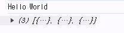
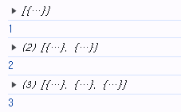
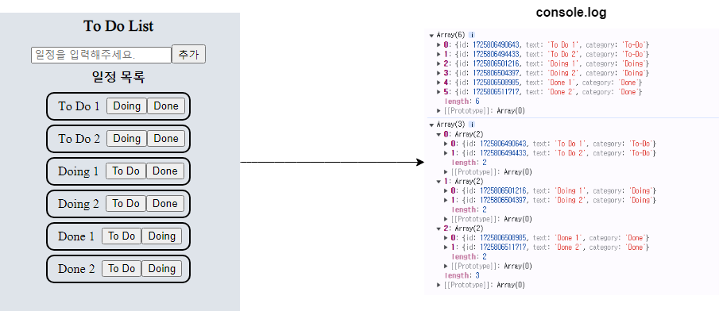
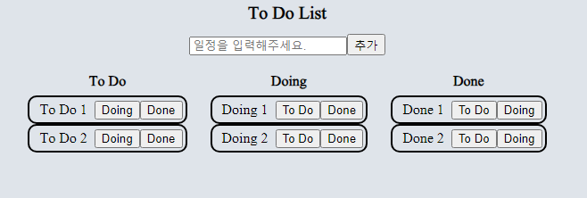

### 개요

- `To Do`의 `category` 변경하는 버튼을 만들고
- 클릭한 버튼에 따라 해당 `To Do`의 `category`를 변경하는 로직을 구현하였다.

- 기존 `To Do List`에서 `To do`는 `category`에 상관 없이 <br/>
	`ToDo_State`에 저장되고 있는 상태이다.

``` ts
export interface I_ToDos {
	id: number;
	text: string;
	category: "To-Do"|"Doing"|"Done";
}

export const ToDo_State = atom<I_ToDos[]>({
	key: "ToDos",
	default: []
});
```

- 내가 추가한 `To Do (일정)`이 `To-Do/Doing/Done` 어느 쪽이든 상관 없이 <br/>
	`ToDo_State` 하나에 전부 모여서 섞여있는 상태이다.

- 이제부터 구현할 것은 `recoil`의 `selector`라는 것을 이용해서 <br/>
	위에서 무작위로 무질서하게 모여있는 `To Do` 들을 카테고리 별로 분류가 되도록 할 것이다.

---

### `selector`

- `selector`는 **파생된 `state` (derived state)** 의 일부를 나타낸다.
- 여기서 `derived state`는 `state`를 입력 받고, 그걸 변형해서 반환하는 <br/>
	순수 함수를 거쳐서 반환된 값을 의미한다.
- 이렇게 만든 `derived state`는 다른 데이터에 의존하는 <br/>
	동적인 데이터를 만들 수 있기 때문에 강력한 개념이다.

``` ts
import {selector} from "recoil";

const toDoSelector = selector(
	key: "toDoSelector",
	get: ({get}) => {}
);
```

- `selector` 함수는 `key`와 `get function`이라는 두 개의 `prop` 가지고 있다.

- `key`: `key` 값으로 사용할 문자열 값을 전달 받는다.

- **`get function`**
	- 인자로 `option` 객체를 받는데, 해당 객체에는 `get function`이 들어가 있다.
	- 여기서 `get function`이 `return`하는 값이, `toDoSelector`의 `value`가 된다.

``` tsx
//get function return 값이 `toDoSelector`의 value가 되는 지 확인하는 예제

const toDoSelector = selector({
	key: "toDoSelector",
	get: ({get}) => {
		return "Hello World";
	}
});

function ToDoList(){
	const SelectorOutput = useRecoilValue(toDoSelector);
	console.log(SelectorOutput);
	
	return (
		<div></div>
	);
}
```



- `selector` 만들고 사용하는 법을 알아봤으니
- 이제 `atom`과 `selector` 연결해보자.

- `selector`는 `atom, recoil state` 가져다가 `output`을 변형시키는 것이 가능하다.
- `selector`의  `get` 함수를 통해서 `atom`의 값을 받아온다.
- 아래 예제를 통해서 확인해보자.

``` tsx
//selector, atom 연계

const ToDo_State = atom({
	key: "ToDos",
	default: []
});

const toDoSelector = selector({
	key: "toDoSelector",
	get: ({get}) => {
		const toDos = get(ToDo_State);
		return toDos.length;
	}
});

function ToDoList(){
	const ToDos = useRecoilValue(ToDo_State);
	const SelectorOutput = useRecoilValue(toDoSelector);
	
	console.log(ToDos);
	console.log(SelectorOutput);
	
	return (
		<div></div>
	);
};
```



- `ToDo_State`에 저장되는 `To Do`의 개수가 늘어날 수록
- 이를 참조하는 `toDoSelector`의 `length`도 점점 올라가는 것을 확인할 수 있다.

- `atom`과 `selector` 연결해보는 연습을 했으니, 다른 기능을 만들어보자.

- `ToDo_State`의 값을 받아오고
- 이를 `Array.filter()` 활용해서, `toDos` 배열에 저장된 값을
- `category` 별로 구분해서 보관하게 해보자.

``` tsx
//To Do, category 별 분류 1

const ToDo_State = atom({
	key: "ToDos",
	default: []
});

const toDoSelector = selector({
	key: "toDoSelector",
	get: ({get}) => {
		const toDos = get(ToDo_State);
		return [
			toDos.filter((toDo) => toDo.category === "To-Do"),
			toDos.filter((toDo) => toDo.category === "Doing"),
			toDos.filter((toDo) => toDo.category === "Done")
		];
	}
});

function ToDoList(){
	const ToDos = useRecoilValue(ToDo_State);
	const SelectorOutput = useRecoilValue(toDoSelector);
	
	console.log(ToDos);
	console.log(SelectorOutput);
	
	/*
		기존 코드...
	*/
};
```



- `To Do 1, 2 / Doing 1, 2 / Done 1, 2`라는 임의의 일정을 만들고
- 버튼을 클릭해서 `Doing`과 `Done`의 `category` 변경하였다.

- 그리고 이를 `console` 통해서 확인해보면
- `ToDo_State`의 변동 사항이 이를 참조하는 `toDoSelector`에도 반영된다.
- `Array.filter()` 함수를 통해서 각 `category` 별로 구분해둔 배열을 `return`한다.
- 그리고 `selector`의 `output`은 `atom`의 `output`과 같이 확인이 가능하다.

---

- 위의 과정을 통해서 `selector` 활용해서 `state`의 `output` 변경해보는 과정을 거쳤다.
- 여기서 `selector`는 `state` 그 자체를 변경하지 않으며, 새로운 `state` 만들지도 않고 <br/>
	**"`state`의 `output` 만을 변경했다."** 라는 점을 잘 기억해두자. 
- `state`의 `output`을 변경했기 때문에, `selector`에서의 변동 사항이 <br/>
	원본 `state`에 영향이 가지 않는다고 봐도 무방하다.

- 마지막으로 `To Do List`에서 `category` 별로 일정이 다른 위치로 이동하는 것처럼
- 보이도록 웹 페이지 화면을 아래와 같이 업데이트를 진행하였다.
- 예시 이미지만 띄워두고, 소스코드는 아래 링크를 참고하도록 하자.



- [`To Do`, `category` 분류, 웹 페이지 반영](https://github.com/Rayched/To-do-List-mkII/commit/3f9671180b5063d03ce758dcc584749d3a7e32f9)

- 약식으로만 이렇게 만들어두고, 실제로는 `Category` 선택해서
- 해당 `category`의 `To Do`만 나오게 할 생각이다.
- 일단 지금은 각 `category` 별 `To Do` Rendering 시킨 것에 의의를 둘 생각이다.

---


