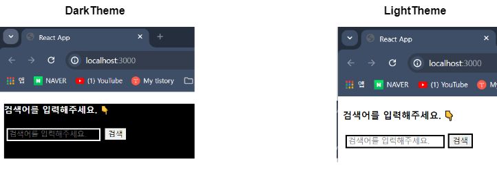

## `TypeScript`와 `styled-components` 연계

### `declaration File` 생성

- 제일 먼저 `styled.d.ts` 파일을 생성한다. <br/>
	(`d.ts` : declaration Filfe 의미한다. / `declaration: 선언, 공표`) 

- `styled.d.ts` 파일을 생성한 후, 아래 링크로 들어가서 <br/>
- 기본 코드를 복사하고, `styled.d.ts`파일에 붙여 넣기를 해주자.
- **[Creating declaration file / styled-components 공식 문서](https://styled-components.com/docs/api#create-a-declarations-file)**

- 이후 `DefaultTheme` Interface에 예전 `Theme`을 구현할 때 추가했던 <br/>
	`textColor`, `bgColor` Property를 추가한다.

``` ts
import 'styled-components';
// and extend them!

declare module 'styled-components' {
  export interface DefaultTheme {
    /*borderRadius: string;
    colors: {
      main: string;
      secondary: string;
    };*/

	textColor: string,
	bgColor: string
  }
}
```

- `style.d.ts` 파일에서는 `styled-components`를 Import하고 <br/>
	`styled-components`의 테마 정의를 확장하는 역할을 한다.

---

### `declaration File` 보충 설명

- `declaration File`, 정의 파일
- 프로젝트를 진행하다보면, 여러가지 외부 라이브러리를 설치를 하게 되는데 <br/>
	`JavaScript`로 프로젝트를 시작했다면 문제가 생기지 않지만 <br/>
	`TypeScript`로 프로젝트를 시작했다면 사소한 문제가 생길 수 있다.

- 외부 라이브러리를 구성하는 파일 중 `.js` 파일 내부에 타입이 정의되지 않았기에 <br/>
	`TypeScript`는 해당 파일을 읽지 못하고 에러를 발생 시킨다.

- 따라서 이를 방지하기 위해서 `TS`에게 `.js` 파일의 모양을 설명해줘야 하는데 
- 이 역할을 하는 것이 `Declaration File`이다.

- 타입 없이 작성된 코드에서 타입을 사용하기 위해서, 특정 타입을 선언해두는 파일
- => `Declaration File` (정의 파일, 선언 파일, ...)

``` ts
import 'styled-components';

declare module 'styled-components' {
  export interface DefaultTheme {
    textColor: string,
    bgColor: string
  }
}
```

- 외부 라이브러리인 `styled-components`의 타입을 지정한 견본 코드로 <br/>
	`TypeScript`에선 이를 바탕으로 자동 완성 기능을 제공한다.

- 요즘 나오는 `JavaScript Library`들은 이러한 기능을 가진 <br/>
	`.d.ts` 파일을 같이 배포하고 있기 때문에
- 이러한 선언 파일을 지원하지 않는 경우에만 작성하면 된다.

---

### 테마 구현하기

- `style.d.ts` 파일에서 `DefaultTheme`이라는 타입을 만들고 <br/>
	`textColor`, `bgColor` 속성을 정의하였다.

- 이제 `theme.ts` 파일을 만들고, `LightTheme`, `DarkTheme` 객체를 생성해주자.
- 이때 두 객체의 타입을 `DefaultTheme`으로 지정하고 <br/>
	`textColor`, `bgColor` 속성에 색상 값을 전달해주도록 하자.

``` ts
import {DefaultTheme} from "styled-components";

export const LightTheme: DefaultTheme = {
	textColor: "black",
	bgColor: "white"
};

export const DarkTheme: DefaultTheme = {
	textColor: "white",
	bgColor: "black"
};
```

- 이후 `index.tsx` 파일에서 `<ThemeProvider>` Import하고 <br/>
	`theme` prop에 `theme.ts`에서 만든 테마 두 개 중 하나를 전달한다.



- 예전에 `JavaScript`로 작성했던 `Theme`과 크게 다르지는 않지만 <br/>
	코드 작성 중에 발생할 수도 있는 실수를 방지할 수 있다는 차이점이 존재한다.

- `theme`의 `textColor`, `bgColor` 속성에 값을 전달하지 않는다거나 <br/>
	코드 작성 중 발생하는 사소한 오타를 코드 실행 전에 파악할 수 있다.

---

### declaration File이 없는 라이브러리를 사용하는 경우

- Project를 진행하다 보면 `declaration File`를 가지고 있지 않은 <br/>
	라이브러리를 사용하게 되는 경우가 있을 수도 있다.

- 그런 경우에는 Github로 들어가서 `declaration File`을 찾는 것도 하나의 방법이지만
- Github에 Backup된 파일의 개수가 매우 많고, 원하는 파일을 찾는 것도 쉽지 않기에
- 아래와 같이 명령어를 입력해서, 현재 사용 중인 라이브러리나 <br/>
	패키지의 `declaration File`을 받아오는 것이 권장된다고 한다.

``` shell
npm i --save-dev @types/Library_name
```

- `JavaScript`로 개발할 때는 상관 없었지만, `TypeScript` 설치한 시점부터 <br/>
	`Type`이 명시되지 않은 라이브러리나 패키지를 다운로드 받으면 <br/>
	`TypeScript`에서 Error를 발생시킨다.

- 그리고 이를 방지하기 위해서 위의 명령어를 입력해서 <br/>
	라이브러리의 `Type` 정의해둔 `Declaration File (선언 파일)` 받아와야 한다.

- `Project` 개발을 `TypeScript`로 시작한 시점에서 알아둬서 나쁠 것은 없으니 <br/>
	일단 여기에 기록해두기로 했다.

- 참고로 이미 만들어진 `d.ts` 파일이 존재한다면 정상적으로 설치가 되겠지만 <br/>
	만약 존재하지 않는다면 설치가 되지 않을 것이다. <br/>
	(없다는 것은 에러 메시지로 파악 가능)