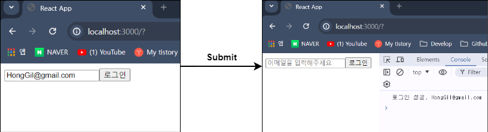

## `event` 타입 지정하기

- 아래 이미지와 같이 검색 바를 만들고, 검색 바에 입력한 검색어를 코드 내에서 <br/>
	참조하기 위해서 아래와 같이 코드를 작성하였다.

``` tsx
function SearchBar(){
	const [Keyword, setKeyword] = useState("");

	const getKeyword = (event) => {
		setKeyword(event.target.value);
	};
	
	return(
		<div>
			<input 
				value={Keyword} 
				type="text" 
				placeholder="검색어를 입력해주세요."
				onChange={getKeyword}
			/>
		</div>
	);
}
```

- 검색 바에 입력한 검색어를 `state`에 저장하기 위해서 <br/>
	`event` 활용하는데, 이때 `event`는 `any` 타입을 가지고 있다.

- `any` 타입은 `number`, `string`, `boolean` 등 다양한 타입의 값을 받을 수 있다.
- 이러한 `any` 타입은 `JavaScript`에 가까운 데이터 타입으로 <br/>
	`TypeScript`에서 `any` 타입의 사용은 가급적이면 지양하는 편이다.

- `event`의 적절한 타입을 찾는 방법은 `구글링`말고는 없다.
- `React.`까지만 입력하고, 수많은 타입 중 적절한 타입을 찾기 위해서 <br/>
	`구글링`을 통해서 정답을 확인하고 이를 적용하는 과정을 거쳐야 한다.

- 위의 코드에서 사용된 `event`에 적절한 타입을 찾아내는데 성공했고 <br/>
	참고한 문서의 링크는 하단에 표기해놨다.

- **[TypeScript - input event의 type은 무엇일까? / YeongMin velog](https://velog.io/@ahn0min/TypeSCript-event-%EC%9D%98-type-%EC%9D%80-%EB%AC%B4%EC%97%87%EC%9D%BC%EA%B9%8C)**

``` tsx
function SearchBar(){
	const [Keyword, setKeyword] = useState("");

	const getKeyword = (event: React.ChangeEvent<HTMLInputElement>) => {
		setKeyword(event.target.value);
	};
	
	return(
		<div>
			<form>
				<input 
					value={Keyword} 
					type="text" 
					placeholder="검색어를 입력해주세요."
					onChange={getKeyword}
				/>
			</form>
		</div>
	);
}
```

- `event`의 Type을 위와 같이 지정하니 Error가 발생하지 않는다. <br/>
	(`target`, `value` 속성이 없다는 식의 Error Message가 발생하지 않게 됐다.)

---

## `<form>`, `React + TS` 연계

- `event` 속성에 맞는 `Type`을 찾는 법도 알았으니 <br/>
	간단한 앱을 하나 구현해보자.

- 사용자 이메일과 로그인 버튼이 있는 간단한 React App을 다음과 같이 구현하였다.

``` tsx
function App(){
	const [Email, setEmail] = useState("");

	const onChange = (event: React.ChangeEvent<HTMLInputElement>) => {
		const {
			currentTarget: {value},
		} = event;
		setEmail(value);
	};

	const onSubmit = (event: React.FormEvent<HTMLFormElement>) => {
		event.preventDefault();
		console.log(`로그인 성공, ${Email}`);
	};
	
	return (
		<div>
			<form onSubmit={onSubmit}>
				<input
					type="text"
					placeholder="이메일을 입력해주세요."
					value={Email}
					onChange={onChange}
				/>
				<button>로그인</button>
			</form>
		</div>
	);
}
```

- `구조분해할당` 기법을 사용해서 `event.currentTarget.value`까지 입력할 필요 없이 <br/>
	`value`만 입력해도 `event.currentTarget.value`와 같은 효과를 누릴 수 있다.

- 아무 email을 입력하고, 로그인 버튼을 누르면 아래와 같이 <br/>
	로그인 성공이라는 문자열이 뜨고, 입력한 이메일을 확인할 수 있다.
	


---

### `구조분해할당 - 객체`

---

### `event.preventDefault()`

---

### `target`과 `currentTarget`의 차이

---

