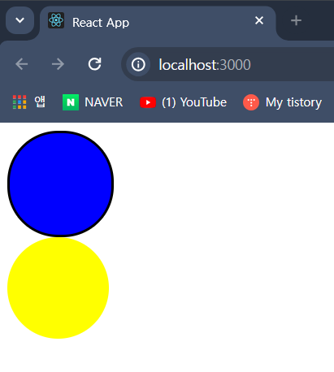

## `props`에 `optional(선택적인)` 설정하기

- `interface` 혹은 `type` 키워드로 객체의 타입을 만들 때 <br/>
	해당 타입이 가진 속성은 기본적으로 `required` 상태이다.

- 이때 `interface`의 특정 속성을 선택적으로 사용하고 싶을 때 <br/>
	사용하는 방법이 `옵션 속성`이다.

- `interface` 속성 이름 뒤에 **`?`** 추가하면, 해당 속성은 옵션 속성으로 설정된다.

``` ts
interface People {
	name: string,
	age?: number
}

const A_People : People = {
	name: "홍길동",
	age: 25
};

const B_People : People = {
	name: "홍길순",
};
```

- 이러한 점을 활용해서 `React component`의 `props`도 <br/>
	`required`에서 `optional`로 바꾸는 것이 가능하다.

---

### 예제

``` tsx
import styled from "styled-components";

interface CircleProps {
	bgColor: string;
}

const Container = styled.div<CircleProps>`
	width: 100px;
	height: 100px;
	background-color: ${(props) => props.bgColor};
	border-radius: 50px;
`;

function Circle({bgColor}: CircleProps){
	return (
		<Container bgColor={bgColor}/>
	);
}

export default Circle;

/**
	* App.tsx
	<Circle bgColor="blue"/>
	<Circle bgColor="yellow"/>
*/
```


- 위의 예제에서 파란색 원에만 테두리를 추가하려고 한다.
- 테두리를 추가하기 위해서, `borderColor`라는 `prop`을 추가하고 <br/>
	`App.tsx`에서 테두리 색상을 아래와 같이 전달한 예제 코드이다.

``` tsx
import styled from "styled-components";

interface CircleProps {
	bgColor: string;
	borderColor?: string;
}

const Container = styled.div<CircleProps>`
	width: 100px;
	height: 100px;
	background-color: ${(props) => props.bgColor};
	border-radius: 50px;

	border: 3px solid ${(props) => props.borderColor}
`;

function Circle({bgColor, borderColor}: CircleProps){
	return (
		<Container bgColor={bgColor} borderColor={borderColor}/>
	);
}

export default Circle;

/**
	* App.tsx
	<Circle bgColor="blue" borderColor="black"/>
	<Circle bgColor="yellow"/>
*/
```


- `borderColor`가 `Optional` 설정이 적용되지 않은 것을 확인할 수 있다.
- `border: 3px solid ${...}` 부분이 잘못 입력된 것을 파악됐기에 <br/>
	Container Component의 CSS 코드를 다음과 같이 수정하였다.

``` tsx
const Container = styled.div<CircleProps>`
	width: 100px;
	height: 100px;
	background-color: ${(props) => props.bgColor};
	border-radius: 50px;

	border: ${(props) => {
		if (!props.borderColor){
			return "none";
		} else {
			return `3px solid ${props.borderColor}`;
		}
	}};
`;
```

- 예제를 재실행하면, 파란색 원에만 테두리가 설정된 것을 확인할 수 있다.



---

### 또 다른 방법 / `??, null 병합 연산자 활용`

- 위의 방법 외에도 또 다른 방법을 사용해서 테두리를 선택적으로 사용할 수 있다.
- 바로 **`?? (null 병합 연산자)`** 활용하는 것이다.

``` js
/**
	* A ?? B (null 병합 연산자)
	* '??' 앞의 값이 null이거나, undefined이면 우측의 값을 (예: B)
	  그렇지 않다면 왼쪽의 값을 (예: A) return하는 논리 연산자
*/
null ?? "hello"; //"hello" return
undefined ?? "hello"; //"hello" return
"hi" ?? "hello" // "hi" return
```

- 이제 이를 참고해서 예제 코드를 `null 병합 연산자` 활용한 형태로 수정해보겠다.

``` tsx
import styled from "styled-components";

interface CircleProps {
	bgColor: string;
	borderColor?: string;
}

const Container = styled.div<CircleProps>`
	width: 100px;
	height: 100px;
	background-color: ${(props) => props.bgColor};
	border-radius: 50px;

	border: 3px solid ${(props) => props.borderColor}
`;

function Circle({bgColor, borderColor}: CircleProps){
	//Before
	/*
	return (
		<Container bgColor={bgColor} borderColor={borderColor}/>
	);
	*/
	
	//After
	return (
		<Container bgColor={bgColor} borderColor={borderColor ?? bgColor}/>
	);
}

export default Circle;
```

- `borderColor` prop에 값이 전달되면 (테두리 색상) <br/>
	전달된 값을 `Container`에게 `border:...${borderColor}` 전달한다. <br/>
	(파란색 원은 `borderColor`에게 `"black"`이라는 값을 전달하였음.)

- 그리고 `borderColor` prop의 값이 `undefined`, 값이 전달되지 않은 경우엔 <br/>
	`null 병합 연산자`에 의해 `bgColor` prop에 전달된 색상 값과 동일한 값을 <br/>
	`Container` Component에게 전달한다.

- 위의 방법을 통해서 테두리 색상을 지정한 파란색 원에는 <br/>
	지정한 색상의 테두리가 추가되고, 지정하지 않은 노란색 원에는 <br/>
	배경색인 `bgColor`에 전달한 값과 동일한 값이 `borderColor` prop에 전달된다.

---

### 추가, `prop`에 `Default Value (기본값)` 추가하기

- `Circle` Component에 추가한 `props`에 초기 값을 전달하는 것이 가능하다.
- 그리고 초기 값을 전달한 `props`는 외부에서 `Circle` 호출 시 <br/>
	해당 `prop`에 별도의 값을 전달하지 않았다면 계속 유지가 된다.

- 아래 예제를 통해 확인해보자.

``` tsx
//Circle.tsx

import styled from "styled-components";

interface CircleProps {
	bgColor: string;
	borderColor?: string;

	//New
	text? : string;
}

const Container = styled.div<CircleProps>`
	width: 100px;
	height: 100px;
	background-color: ${(props) => props.bgColor};
	border-radius: 50px;

	border: 3px solid ${(props) => props.borderColor};

	font-weight: bold;
	display: flex;
	justify-content: center;
`;

function Circle({bgColor, borderColor, text="기본값"}: CircleProps){
	return (
		<Container bgColor={bgColor} borderColor={borderColor ?? bgColor}>
			{text}
		</Container>
	);
}

export default Circle;

//App.tsx
//<Circle bgColor="blue" borderColor="black"/>
//<Circle bgColor="yellow" text="Yellow"/>
```

- 예제를 실행하면, `text` prop에 별도의 값을 전달하지 않으면 <br/>
	`"기본값"`이라 적힌 텍스트가 출력된다. (파란색 원)

- 그리고 `text` prop에 값을 전달한 Component에는 <br/>
	전달한 값이 그대로 출력되는 것을 확인할 수 있다. (노란색 원)


---


