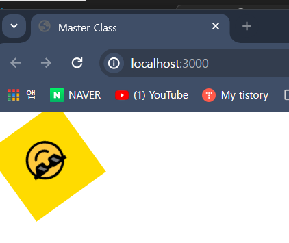
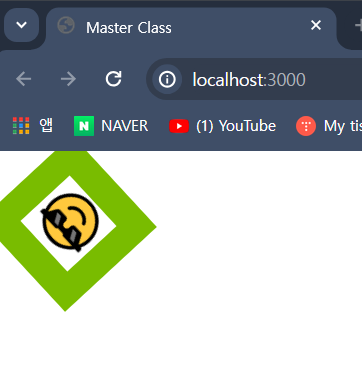

## 목차

```
1. helper Function 'keyframe'
 - style components에 animation 효과를 추가하기 위해서
 - 먼저 import해야하는 함수
2. animation 효과 정의, style component 적용하기
3. Style Component 내부 요소 선택하는 방법 (1)
 - style component가 아닌 자식 요소에 style 설정하는 방법
4. 자식 요소에 'hover' 등의 별도 효과 추가
```

---

### helper Function `keyframe` 

- `styled-components`에서 animation 효과를 추가하려면
- 먼저 `keyframe`이라는 `helper function`을 Import해야 한다.

``` js
import styled, { keyframes } from "styled-components"
```

- 위와 같이 `keyframes` 함수를 Import 했다면, 아래와 같이 작성해서 사용할 수 있다.

``` jsx
const animation = keyframes`
	from {
	}
	to {
	}
`;
```


``` jsx
const Box = styled.div`
	width: 200px; height: 200px;
	background-color: green;
	animation: ${animation};
`;

```
---

### `animation` 효과 정의, style component 적용

``` jsx
const animation : keyframes`
	0% {
		transform: rotate(0deg);
	    background-color: red;
	}
	25% {
		transform: rotate(90deg);
		background-color: orange;
	}
	50% {
		transform: rotate(180deg);
		background-color: yellow;
	}
	75% {
		transform: rotate(270deg);
		background-color: green;
	}
	100% {
		transform: rotate(360deg);
		background-color: blue;
	}
`;

const Box2 = styled.div`
  width: 100px; height: 100px;
  animation: ${animation} 5s linear infinite;
  background-color: gray;
`;
```

- 0 ~ 100%까지 Animation Style을 설정할 수 있다.
- 설정한 Animation 효과는 Style Component에서 <br/>
	`animation: ${animation}`과 같은 형식으로 참조할 수 있다.

---
### `Style Component` 내부 요소 선택 방법 1

- `Style Component`가 아닌 자식 요소에 CSS Style을 적용하고 싶다면 <br/>
	아래와 같은 형식으로, 자식 요소의 CSS 스타일을 설정할 수 있다.

``` jsx
const Box = styled.div`
	width: 100px; height: 100px;
	animation: ${animation} 5s linear infinite;
	background-color: gray;
	display: flex;
	justify-content: center;
	align-items: center;
	
	/* New */
	span {
		font-size: 40px;
	}
	
`;

function App(){
	return (
		<Wrapper>
			<Box>
				<span>😎</span>
			</Box>
		</Wrapper>
	);
}
```



- `Style Component`인 `Box` Component와 내부의 자식 요소인 `span`까지 <br/>
	CSS Style을 적용한 모습을 확인할 수 있다.

---

### 자식 요소에 `hover` 등의 별도 효과 추가

- 기존 예제의 `span` Component에 마우스를 갖다 대면 배경 색이 바뀌게 하고 싶다.
- 즉 `hover` 효과를 추가하고 싶다는 것이다.
- 보통은 `span: hover {...}`와 같이 작성하지만 아래와 같이 대체할 수 있다.

```jsx
const Box = styled.div`
	width: 100px; height: 100px;
	animation: ${animation} 5s linear infinite;
	background-color: gray;
	display: flex;
	justify-content: center;
	align-items: center;
	span {
		font-size: 40px;
		&: hover {
			/*span: hover {} 대체*/
			background-color: white;
		}
	}
`;

function App(){
	return (
		<Wrapper>
			<Box>
				<span>😎</span>
			</Box>
		</Wrapper>
	);
}
```



- 위의 이미지에선 마우스 커서를 갖다 댄 모습이 보이진 않지만 <br/>
	실제론 `span` 요소의 배경 색이 부모 요소인 `Box`와 동일한 색상에서 <br/>
	마우스를 갖다 대면 배경 색이 흰색으로 바뀐다.
---
### `styled components` 내부 요소 선택 방법 2

- 기존 `JavaScript`에서 문자에 변수를 전달하던 방식처럼 <br/>
	내부 요소도 전달할 수 있다.
* 아래와 같이 기존의 `span` 요소를 `Emoticon`이라는 `styled component` 대체하면 <br/>
	`Box` Component 내부의 `span {...}` 코드는 의미가 없어진다.
- 대신 변수를 값으로 전달하던 방식처럼 `${Emoticon} {...}`과 같이 작성해서 <br/>
	`Box` Component 내부 요소를 선택하는 것이 가능하다.

``` jsx

const Emoticon = styled.span`
	font-size: 40px
`;

const Box = styled.div`
	width: 100px; height: 100px;
	animation: ${animation} 5s linear infinite;
	background-color: gray;
	display: flex;
	justify-content: center;
	align-items: center;

	/*
		* span => Emoticon 대체한 상태
		* span {...} 의미가 없어짐
	*/

	${Emoticon}{
		&:hover {
			font-size: 60px;
			background-color: white;
		}
	}
`;
function App(){
	return (
		<Wrapper>
			<Box>
				<Emoticon>😎</Emoticon>
			</Box>
		</Wrapper>
	);
	//기존 span 요소, Emoticon이라는 styled-components로 대체하였다.
}
```

- 결과물은 이전 장 예제와 엄청 큰 차이가 없기 때문에 <br/>
- 별도의 이미지는 생략하였음.

---
### 📔 Reference

- **[CSS / `@keyframes`](https://developer.mozilla.org/ko/docs/Web/CSS/@keyframes)**
- **[CSS / animation 속성](https://developer.mozilla.org/ko/docs/Web/CSS/animation)**
- [Nomad Coder - React Masterclass](https://nomadcoders.co/react-masterclass)

---
