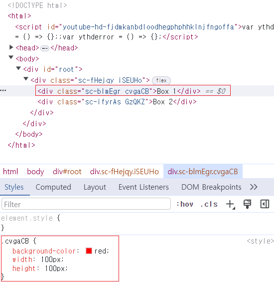
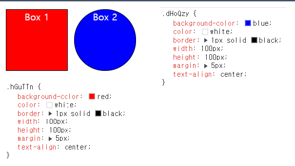

#### 사전 준비 / `style component` 설치

- `styled-components` 설치 명령어

``` shell
npm install styled-components
npm i styled-components
```

- `styled-components` CSS 자동 완성 기능은 VSCode Extension 설치해서 사용 가능
- **"vscode-styled-components"** 👈 VSCode Extension Name

---

#### 예제 코드 (`styled-components` 사용 전)

``` jsx
//Style Component 사용 전
//Style Property 추가해서 React Component에 style 적용

function App(){
	return (
		<div style={{ display: "flex"}}>
			<div style={{ backgroundColor: "red", width: 100, height: 100}}>
				Box 1 
			</div>
			<div style={{ backgroundColor: "blue", width: 100, height: 100}}>
				Box 2
			</div>
		</div>
	);
}
```

- `CSS` File 별도로 Import 하지 않은 형태의 코드
- 다만 `CSS Style`을 `JavaScript` 코드로 작성해야 하므로 <br/>
	다소 불편하고 직관적이지 않은 게 조금 흠이다.
- 그리고 `<div>` 요소가 좀 많이 들어가서 코드의 가독성이 좋지 않게 보인다.
- 이제 `styled-components` 사용해서 위의 예제 코드를 개선해보자.

---
### `styled component` 만들기

- `styled-components` Import한 상태에서 아래와 같이 입력해서 <br/>
	`Styled component` 생성할 수 있다.

``` jsx
import styled from "styled-components";

//const styledCompo = styled.'HTML_Tag_Name'`(Back Tick)`;
const StyledCompo = styled.div`
	/* CSS Code */
`;
```

- 생성할 `Styled Component`의 HTML 요소를 지정한 다음
- 해당 Component의 CSS Code는 `(백틱)` 내부에 작성한다.
- 이후 `App` 함수에서 `Styled Component` 호출 <br/>
	지정해둔 CSS Style이 적용된 React Element가 return된다.

- 이제 이를 앞의 예제 코드에 적용해보자.

---
### 기존 예제 코드에  `styled Component` 적용

``` jsx
import styled from "styled-components";

const Parents = styled.div`
  display: flex;
`;

const Box1 = styled.div`
	background-color: red;
	width: 100px;
	heigth: 100px;
`;

const BoxTwo = styled.div`
  background-color: blue;
  width: 100px; 
  height: 100px;
`;

function App() {
  return (
    <Parents>
	    <BoxOne>Box 1</BoxOne>
	    <BoxTwo>Box 2</BoxTwo>
    </Parents>
  );
}
```

- 기존 코드에서 모든 `<div>` 요소를 `Parents`, `Box 1 / 2` Component 대체한 상태
- 별도로 CSS Style을 수정하지는 않았기 때문에, 결과물은 동일하다.
- 물론 기존 코드에서 모든 `<div>` 요소들을 `styled-components` 대체했기에 <br/>
	코드의 가독성이 좀 더 나아진 느낌을 받을 수 있다.

- 크롬 개발자 Console에서 생성된 Element를 확인해보면 <br/>
	`styled-components`가 각 요소에 임의의 `className` 추가한 것을 확인할 수 있다.



---
### 코드 중복 줄이기

#### `props` 활용해서 중복 줄이기

- `styled components` 활용해서 `<div>` 요소로 범벅이던 코드를 좀 더 보기 좋게 <br/>
	수정했지만, 다만 아직 부족한 감이 있다.
- `Box1, Box2`는  `background-color`를 제외한 나머지 설정은 전부 동일하다.
- 큰 차이가 없는 Component 여러 개를 만들 필요 없이 <br/>
	하나의 `Box` Component만 만들고, 개별적인 설정이 가능하게 해보자.
- `React Component`에 각기 다른 데이터를 전달하고자 할 때
- `props` 사용했던 것처럼 똑같이 `background-color`에 `props` 전달하면 된다.

``` jsx
import styled from "styled-components";

const Parents = styled.div`
  display: flex;
`;

const Box = styled.div`
	background-color: ${(props) => props.bgColor};
	color: white;
	width: 100px;
	heigth: 100px;
	border: 1px solid black;
	margin: 5px;
`;

function App() {
  return (
    <Parents>
	    <Box bgColor="red">Box 1</Box>
	    <Box bgColor="blue">Box 2</Box>
    </Parents>
  );
}
```

- `<Box>` Component에 `'bgColor' props` 추가하고 <br/>
	`bgColor` 의 값을 받는 Callback을 `background-color`에 추가해준다. <br/>
- 이제 예제를 확인해보면 `background-color`가 각기 다르게 적용된 것을 확인할 수 있다.
---

#### `styled('Component Name')` 활용해서 중복 줄이기

##### 일종의 Component 상속하기

- 이번에는 `Circle`이라는 새로운 Component 만든 다음 <br/>
- `<Box>Box 2</Box>` 요소를 `<Circle>Box 2</Circle>` 대체해보자.

``` jsx
import styled from "styled-components";

const Parents = styled.div`
  display: flex;
`;

const Box = styled.div`
	background-color: ${(props) => props.bgColor};
	color: white;
	width: 100px;
	heigth: 100px;
	border: 1px solid black;
	margin: 5px;
`;

const Circle = styled.div`
	background-color: ${(props) => props.bgColor};
	color: white;
	width: 100px;
	heigth: 100px;
	border: 1px solid black;
	margin: 5px;

	border-radius: 50px //New
`;

function App() {
  return (
    <Parents>
	    <Box bgColor="red">Box 1</Box>
	    <Circle bgColor="blue">Box 2</Circle>
    </Parents>
  );
}
```

- `Circle`이라는 새로운 Style Component를 추가했지만 <br/>
	`border-radius` 한 줄 빼고는 `Box` Component와 중복된 코드를 가지고 있다.
- 결과적으로 또 같은 코드가 중복되기 때문에, 별로 좋은 방식은 아니다.
- 그리고 이는 `styled(Component Name)` 함수를 활용해서 개선할 수 있다.

``` js
const Circle = styled(Box)`
	border-radius: 50px;
`;
```

- `styled()` 함수는 객체 지향 문법의 **'상속 (extends)'** 기법과 비슷하다고 보면 된다.
- `styled` 뒤에 HTML 태그를 붙이지 않고 대신 `()` 추가하고

- `(소괄호)` 내부에 상속 받을 Component를 명시하면 <br/>
- 해당 Component가 가진 `CSS Code`를 상속 받는다.
- 상속 받은 자식 Component 만의 `CSS Code`를 작성해도 <br/>
	부모 Component에게는 영향이 가지 않는다.

- 이제 이를 바탕으로 위의 코드를 수정해보자.

---

``` jsx
import styled from "styled-components";

const Parents = styled.div`
  display: flex;
`;

const Box = styled.div`
	background-color: ${(props) => props.bgColor};
	color: white;
	width: 100px;
	heigth: 100px;
	border: 1px solid black;
	margin: 5px;
`;

const Circle = styled(Box)`
	border-radius: 50px;
`;

function App() {
  return (
    <Parents>
	    <Box bgColor="red">Box 1</Box>
	    <Circle bgColor="blue">Box 2</Circle>
    </Parents>
  );
}
```

- 수정 전 코드와 비교했을 때 더 깔끔해졌다.
- 스타일을 수정하지는 않았기 때문에, 결과는 동일하다.



---

