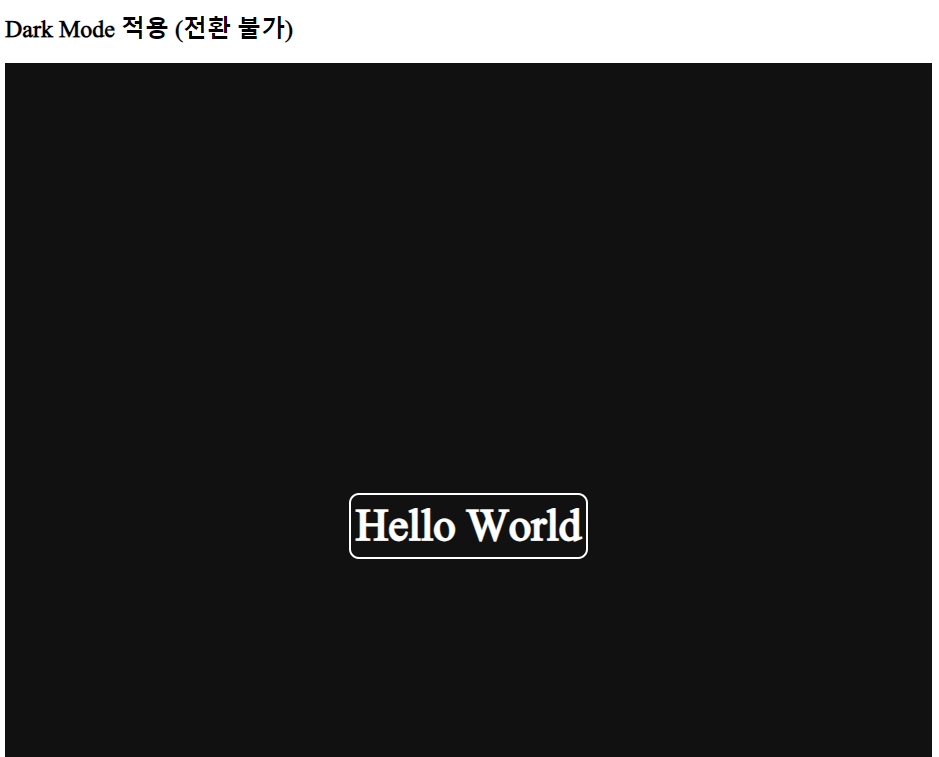

## `styled-components` 활용해서 Dark mode 구현하기

### `theme` 객체 Object

- 제일 먼저 `index.js` 파일에서 아래와 같이 <br/>
	`styled-components`의 `ThemeProvider`를 Import한다.
- 그 후 `App` Component 호출하는 코드를 `<ThemeProvider>`로 감싸준다.
- 이후 `<ThemeProvider>`에 `theme` props 아래와 같이 전달한다. <br/>
	(`ThemeProvider`에서 `theme` props가 required <br/>
	필수로 전달해야 하는 props로 설정됐기 때문에 무조건 전달해야 한다.)

``` jsx
//index.js
import React from 'react';
import ReactDOM from 'react-dom/client';
import App from './App';

import { ThemeProvider } from "styled-components"; //1

const root = ReactDOM.createRoot(document.getElementById("root"));

//다크/라이트 테마 별 CSS 값 설정
const darkTheme = {
	textColor: "white",
	backgroundColor: "#111",
	borders: "2px soild white"
};

const lightTheme = {
	textColor: "tomato",
	backgroundColor: "white",
	borders: "2px solid red"
};

root.render(
	<React.StrictMode>
		<ThemeProvider theme={darkTheme}>
			<App />
		</ThemeProvider>
	</React.StrictMode>
);
```

- 이때 `App` component는 `ThemeProvider`의 하위 요소로 지정됐기 때문에 <br/>
	`ThemeProvider`의 `props`인 `theme`에 전달한 `darkTheme` 객체를 참조할 수 있다.

- 이제 `App` Component로 돌아와서 기존 코드에서 `color`, `background-color`의 값을 <br/>
	아래와 같이 수정하도록 하자.

``` jsx
//App.js (After Update)

import styled from "styled-components";

const Wrapper = styled.div`
	display: flex;
`;

//수정 시작
const Title = styled.h2`
	font-size: 30px;
	//color: tomato;
	color: ${(props) => props.theme.textColor};
`;

const Box = styled.div`
  display: flex;
  flex-direction: column;
  justify-content: center;
  align-items: center;
  width: 100vw;
  height: 100vh;
  
  //background-color: white;
  background-color: ${(props) => props.theme.backgroundColor};

  ${Title}{
    &:hover{
      //border: 3px solid red;
      border: ${(props) => props.theme.borders};
      
      border-radius: 10px;
      padding: 5px;
      font-size: 45px;
    }
  }
`;
//수정 종료

function App(){
	return (
		<div>
			<h2>기존 코드</h2>
			<Wrapper>
				<Box>
					<Title>Hello World</Title>
				</Box>
			</Wrapper>
		</div>
	);
}
//수정 가능 종료
```

- **[기존 예제 영상](https://youtu.be/WuNvHjs5Qj0?si=3k7VZyuKW2YW-WhK)**

- 기존 예제에서 위와 같이 수정을 하면 이런 식의 결과가 나온다.



- `ThemeProvider`의 `theme` prop에 전달한 객체 Property 값들이 제대로 반영된 것을 <br/>
	위의 예제 실행 결과를 통해서 확인할 수 있다.
- `index.js`에서 `theme` props에 전달한 객체를 `lightTheme` 변경하면 <br/>
	다시 기존 테마로 돌아온다. (CSS Style 기존 코드와 동일하게 설정하였음.)
- 아직은 수동으로 테마를 전환하는 단계에서 끝나는 것 같다.

- 여기서 `light`나 `dark`와 같은 테마 기능을 만들 때 <br/>
	`theme` props에 전달하는 객체의 Property 값을 동일하게 설정하면 <br/>
	`App.js`에서 별도 수정 없이, `theme` props 값만 수정하는 것으로 <br/>
	테마의 전환이 가능해지니 이 점 유의해두자...

---

### 📔 마치며...

- 사실 `ThemeProvider`의 `props`를 하위 요소인 `App`에서 어떻게 참조가 가능한 지 <br/>
	이 글을 쓰는 시점에서 이해하지 못했다.
- 일단 댓글을 참고해보니 `closer`와 `실행 컨텍스트`에 대해 알아둬야 <br/>
	이해가 조금 수월해진다고 하는 것 같다.
- `closer`와 `실행 컨텍스트`에 대해 알아 본 다음, 정리한 걸 다시 보면 <br/>
	조금이라도 이해하기 수월할 것 같다.

