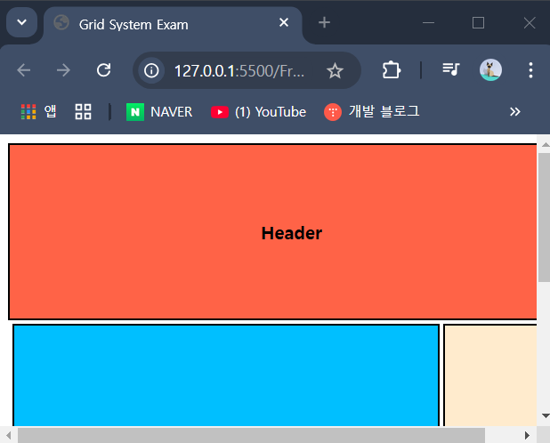
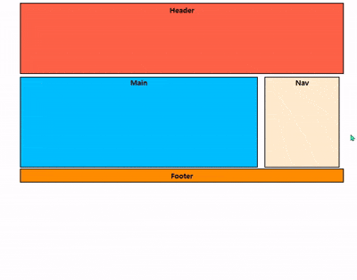

### 가변 그리드 (`Grid System`)


- `em` 이용해서 폰트 사이즈를 상대적인 크기로 설정하는 것처럼
- 레이아웃에도 이러한 개념을 적용하는 것이 가능하다.

- 가변형 레이아웃을 만들 때 사용할 수 있는 단위로 `%`가 있다.

---

#### `%`

- 백분율 값을 의미
- 부모 요소와의 상대적인 크기를 지정할 때 사용
- 너비, 높이, 여백 (`width, height, margin, padding`) 사용 가능 <br/>
	글자 크기를 지정할 때도 사용할 수 있다.

``` css
font-size: 50%;
/*부모 요소 글자 크기의 50% 정도의 사이즈로 지정*/
width: 50%;
height: 50%;
/* 부모 요소의 너비, 높이의 50% 정도 크기로 지정*/
```

- `너비 width`, `여백(padding, margin)` == 부모 요소 너비 비례
- `높이 height` == 부모 요소 높이 비례

---
#### 예제 1


- 위의 예제에서 `Header, Main, Nav, Footer`의 크기는
- 절대 단위인 `px`로 지정 해둔 상태이다.

``` css
.parents {
	width: 500px;
	height: 500px;
	font-weight: bold;
}
  
.header {
	display: flex;
	text-align: center;
	justify-content: center;
	align-items: center;

	margin: 3px 0px;
	padding: 3px;
	border: 2px solid black;
	background-color: tomato;
	width: 500px;
	height: 150px;
}

.nav {
	display: flex;
	justify-content: center;
	align-items: center;
	
	padding: 3px;
	border: 2px solid black;
	background-color: blanchedalmond;
	width: 100px;
	height: 200px;
	float: right;
}

.main {
	display: flex;
	justify-content: center;
	align-items: center;

	padding: 3px;
	border: 2px solid black;
	background-color:deepskyblue;

	float: right;
	width: 375px;
	height: 200px;
	margin-right: 3px;
	margin-bottom: 3px;
}

.footer {
	display: flex;
	text-align: center;
	justify-content: center;
	margin: 3px 0px;
	padding: 3px;
	border: 2px solid black;
	background-color:darkorange;
	width: 500px;
}
```

- 각 요소의 크기가 `px`로 지정됐기 때문에
- 아래 사진처럼 브라우저의 크기를 줄여도
- 예제의 모든 요소에게 영향이 가지 않는다.



- 이제 예제 모든 요소의 너비 `width`의 값을 `px`에서 <br/>
	`%`로 수정해보자.
- 이를 통해서 가변 레이아웃을 구현할 수 있다.



- 브라우저의 크기를 줄이면 이에 맞춰서
- 예제의 모든 요소의 크기도 자동으로 조정되는 것을
- 위의 이미지를 통해서 확인할 수 있다.

---

