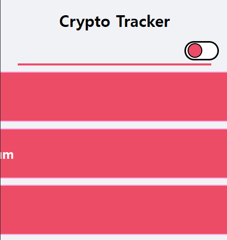

### 상대 단위, Part 1 (`px`, `em`, `rem`)
#### `px, pixel`

- 절대 길이 단위
- 어떠한 상황에서도 동일한 값을 유지하므로, 가변성이 없다.



- 위의 웹 사이트를 개발할 때, 각 요소의 크기 설정을 할 때 <br/>
	`px`로 설정을 했기 때문에 PC 환경에선 문제 없었지만 <br/>
	모바일 환경에서는 이런 식으로 나온다.

---
#### `em`, `rem`

- `em, rem`, 박스에서 텍스트 크기를 조정할 때 사용하는 상대 단위

- **`em`**
	- 부모 요소의 폰트 사이즈에 의해 자식 요소의 폰트 사이즈가 결정되는 방식
	- `em`으로 내, 외부의 여백 (`padding`, `margin`) 크기를 지정할 경우 <br/>
		자기 자신의 텍스트 크기를 기준으로 설정한다.

- **`rem`**
	- `Root + em`
	- `em`과는 다르게 `Root`의 폰트 사이즈에 의해 결정되는 방식 <br/>
		(`Root => <html> or <body>`)

---

``` html
<html>
<head>
	<meta charset="UTF-8">
	<meta name="viewport"
	content="width=device-width, initial-scale=1.0">
	<title>Units Example</title>
	<style>
		.Outer {
			font-size: 24px;
			display: flex;
			flex-direction: row;
			justify-content: space-between;
	
			.box {
				display: flex;
				justify-content: center;
				align-items: center;        
				width: 150px;
				height: 150px;
				background-color: tomato;
				margin: 3px;
			};
		}
	
		#box1 {
			font-size: 1em;
			padding: 1em;
		}
	
		#box2 {
			font-size: 1em;
			padding: 1rem;
		}
	
		#box3 {
			font-size: 1rem;
			padding: 1em;
		}
	
		#box4 {
			font-size: 1rem;
			padding: 1rem;
		}
	</style>
</head>
<body>
	<div class="Outer">
		<div class="box" id="box1">em / em</div>
		<div class="box" id="box2">em / rem</div>
		<div class="box" id="box3">rem / em</div>
		<div class="box" id="box4">rem / rem</div>
	</div>
</body>
</html>
```

- 위의 예제를 통해서 `font-size`와 `padding` 값을 `1em / 1rem` <br/>
	조합해서 사용했을 때 어떤 변화가 발생하는 지를 확인하였다.


- `font-size`의 값을 `1em` 설정하면, 부모 요소 `outer`의 `font-size: 24px` <br/>
	자식 요소인 `box's`의 텍스트 크기가 `24px`로 설정된다.

- 반대로 `font-size: 1rem` 설정하면, `root` 요소의 텍스트 크기를 따라가는데 <br/>
		`<html>, <body>`의 `font-size` 지정하지 않았기 때문에 <br/>
		기본 값인 `16px`이 `box's`의 텍스트 크기로 결정된다.

- 그 다음 `padding` 값을 확인해보자.

- `padding`의 값을 `1em` 설정한 경우, 자식 요소의 텍스트 크기가 기준이 된다. <br/>
	즉, `font-size: 1em (==24px)`이면 `padding: 1em(==24px)`이 되고 <br/>
	`font-size: 1rem(==16px)`이면 `padding: 1em(==16px)`로 설정된다.

- 물론 `padding: 1rem` 설정했다면, 자식 요소의 `font-size`가 기준이 되지 않고 <br/>
	`root` 요소의 텍스트 크기를 따라가게 된다.

---

### 상대 단위, Part 2

- 이번에 다룰 것은 `Viewport` 기반으로 값을 계산해서
- 크기를 결정하는 가변 단위인 `vw, vh, vmin, vmax` 다뤄볼 것이다.

#### `vw / vh (viewport width / viewport height)`

- 현재 보여지는 웹 상 화면, `Viewport` 기준으로 너비와 높이를 정하는 단위

``` css
font-size: 1vw; /*Viewport 너비, 1/100*/
font-size: 1vh; /*Viewport 높이, 1/100*/
```

---
#### `vmin / vmax`

- `vmin`: `Viewport`의 너비와 높이 중 더 **작은 값** 기준으로 백분율 차지
- `vmax`: `Viewport`의 너비와 높이 중 더 **큰 값** 기준으로 백분율 차지

``` css
font-size: 1vmin; 
/*Viewport 너비와 높이 중, 더 작은 쪽의 1/100 크기 설정*/
font-size: 1vmin; 
/*Viewport 너비와 높이 중, 더 큰 쪽의 1/100 크기 설정*/
```

---

### 상대 단위, Part 3

#### `%`

- 백분율 값을 의미
- 부모 요소와의 상대적인 크기를 지정할 때 사용하는 단위
- 너비, 높이, 여백 등의 크기를 지정할 때 사용할 수 있다.

``` css
width: 50%;
height: 50%;
```

- `width, padding, margin` => 부모 요소의 `width(너비)` 비례
- `height` => 부모 요소의 `height(높이)` 비례

---

#### `%` 예제

``` html
<html>
<head>
	<meta charset="utf-8"/>
	<title>Example</title>
	<style>
		.Wrapper {
			font-size: 20px;
			font-weight: bold;
		}
		
		/*요소 전체 공용 스타일*/
		.Box {
			display: flex;
			justify-content: center;
			align-items: center;
			padding: 3px;
		}
		
		/*요소 개별 스타일*/
		header {
			color: white;
			background-color: tomato;
			width: 604px;
			height: 150px;
		}
		
		nav {
			width: 150px;
			height: 200px;
			float: left;
			color: white;
			background-color: blue;
		}
		
		main {
			width: 448px;
			height: 200px;
			float: right;
			background-color: yellow;
		}
		
		footer {
			color: white;
			background-color: green;
			width: 604px;
			height: 150px;
		}
	</style>
</head>
	<body>
		<div class="Wrapper">
			<header class="Box">Header</header>
			<nav class="Box">Nav</nav>
			<main class="Box">Main</main>
			<footer class="Box">Footer</footer>
		</div>
	</body>
</html>
```

- 위의 예제의 모든 Box 요소의 크기는 절대 단위인 `px`로 설정된 상태이다.
- 즉, 아래 사진처럼 브라우저 화면이 줄어들어도
- 각 요소의 크기에는 변화가 발생하지 않는다.


- 이제 각 요소의 `width` 값을 절대 단위인 `px`에서
- 상대 단위인 `%`로 수정하고 그 결과를 확인해보자.

---

#### `%` 예제_Update

- 제일 먼저 상단/하단에 해당되는 `header`와 `footer`의 `width: 90%`로 설정하였다.

- 이제 여기에 맞춰서 `nav`와 `main`의 배율을 조금씩 조정하였다.

- `nav`와 `main`의 비율을 `2:8` 이나 `3:7`에 가깝게 `width`의 값을 조정했는데 <br/>
	여기서 `nav`와 `main` 사이의 여백이 사라지지 않는 문제가 발생했다.


- 이런 식으로 `main`이 `Header`와 `Footer` 사이에서 튀어나오는데
- 이는 내가 원하는 형태가 아니기 때문에 이를 해결하기 위해서
- `main`과 `nav`의 `width` 값을 계속 조정해봤지만 변함은 없었다.

- 그러다가 혹시나 해서, `main`의 `float: right` 속성을 제거해보니 <br/>
	`Main`과 `Nav` 사이의 여백이 사라지는 것을 확인할 수 있었다.

- 이제 `Main`의 `width`를 조금씩 조정하였고, 최종 결과물은 다음과 같다.


``` css
.Wrapper {
	font-size: 20px;
	font-weight: bold;
}

.Box {/* 수정 X */}

header {
	color: white;
	background-color: tomato;
	/*width: 604px;*/
	width: 90%;
	height: 150px;
}

nav {
	/*width: 150px;*/
	width: 25%;
	height: 200px;
	float: left;
	color: white;
	background-color: blue;	
}

main {
	/*
		삭제
		width: 448px;
		float: right;
	*/
	width: 64%;
	height: 200px;
	background-color: yellow;
}

footer {
	color: white;
	background-color: green;
	/*width: 604px;*/
	width: 90%;
	height: 150px;
}
```

---


