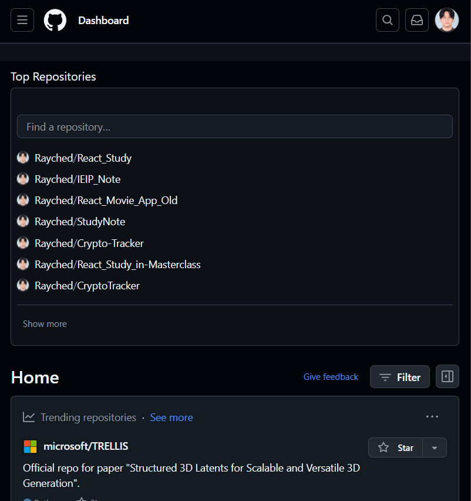
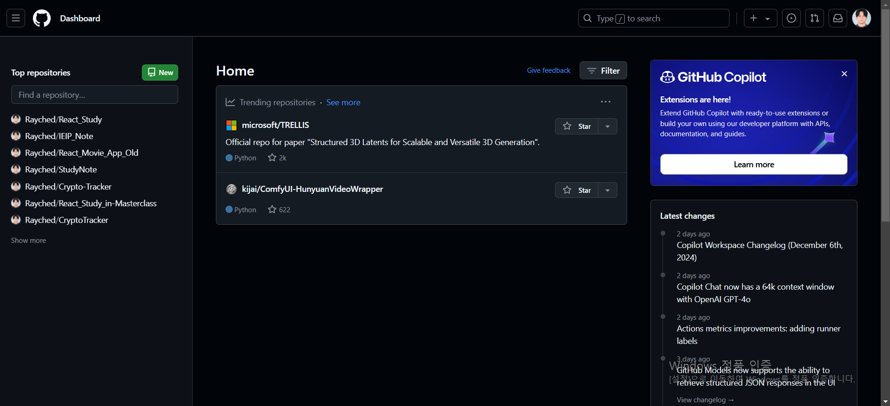
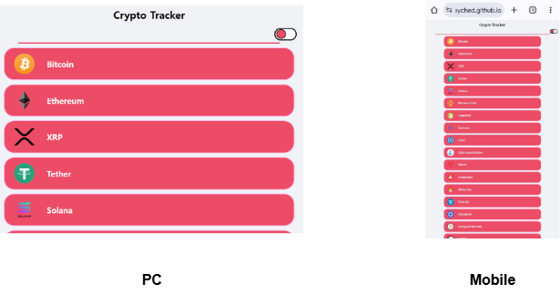
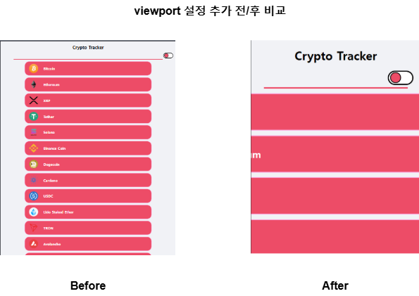

### 반응형 웹 Responsive Webpage

- 다양한 기기, 브라우저의 크기에 맞게 구성, 크기를 변경해가며 <br/>
	반응하는 웹 문서 or 이를 위해 사용하는 기법을 의미한다.





- **▲ 사용자가 접속한 기기의 화면 크기에 따라 웹 페이지 구성이 달라진다.**
- 반응형 웹에서 가장 핵심이 되는 것은 `가변성`이다.
- 사용자가 접속한 기기에 따라 적절하게 맞춰져야 한다.

---

#### `viewport`

- 현재 화면에 보여지는 영역을 의미
- 기기 별로 `viewport` 다르기 때문에, 동일한 웹 페이지를 접속해도 <br/>
	각 기기에 따른 배율 조정이 발생, 화면 크기가 다르게 보이는 현상이 발생한다.



- 위의 이미지는 필자가 개발했던 `Crypto-Tracker`라는 웹 페이지를 <br/>
	PC와 스마트폰으로 확인했을 때의 모습이다.

- `Viewport` 설정을 하지 않았기에 내 의도와는 다른 모습이 나온다.
- 웹 페이지를 개발할 때는 기기마다 다른 화면 크기에 대응하기 위해서 <br/>
	아래와 같이 `viewport` 속성에 대한 markup 추가해야 한다.

``` html
<meta name="viewport" content="width-device-width, initial-scale=1.0"/>
<!-- 
	index.html 문서의 모든 콘텐츠의 너비를 기기 화면의 너비를 기준으로 초기화
	초기 scale을 1로 설정
-->
```




---

