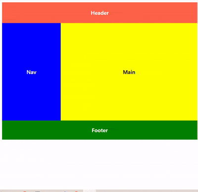

### Media Query

- `Media Type` 인식하고, 콘텐츠를 읽어내는 기기
- 브라우저의 물리적 속성을 감지할 수 있는 기능
- `Media Type`, `Query` 두 가지로 구성

``` css
@media MediaTypes and (조건식){
	/*
		'Media Type', 조건식을 모두 만족할 때
		적용시킬 CSS Style 코드's
	*/
};
```

- **`MediaTypes`**
	- 아래 코드가 어떤 미디어를 위한 것인지 <br/>
		브라우저에게 알려주는 미디어 유형
	- 지정 가능한 미디어 유형: `all`, `print`, `screen`

- **`(조건식)`**
	- `{코드 블럭}` 내부에 작성해둔 `CSS Style`이 적용되기 위한 조건
	- 사용 가능한 조건: `min-width`, `max-width`, `orientation`, ...
	- `orientation`: 화면의 현재 방향을 알려주는 속성

- **`{코드 블럭}`**
	- `조건문` 통과하고, `Media Type` 문제가 없는 경우 <br/>
		웹 페이지에 적용될 `CSS Style` 명시한다.

---

#### `mediaquery 예제`

- `mediaquery`에 대한 기본적인 것은 알았으니 이제 예제를 통해 숙달해보자.


- 예제에서 브라우저의 화면을 최대로 줄여도 (`width: 500px` 정도 나왔다.) <br/>
	각 요소의 배치에는 변동이 없고, 너비만 줄어들었다.
	
- 이제 `mediaquery` 활용해서 브라우저 화면을 최대로 줄였을 때 <br/>
	`Nav, Main`이 가로가 아닌, 세로로 배치되게 해보자.

``` html
<div class="Wrapper">
	<header class="Header">Header</header>
	<nav class="Nav">Nav</nav>
	<main class="Main">Main</main>
	<footer class="Footer">Footer</footer>
</div>
```

``` css
.Wrapper {
	font-weight: bold;
	font-size: 20px;
}

.Header {
	background-color: tomato;
	color: white;
	padding: 3px 0px;
	width: 100%;
	height: 10vh;
	display: flex;
	justify-content: center;
	align-items: center;
}

.Nav {
	color: white;
	background-color: blue;
	width: 30%;
	height: 50vh;
	padding: 3px 0px;
	display: flex;
	justify-content: center;
	align-items: center;
	float: left;
}

.Main {
	float: right;
	width: 70%;
	height: 50vh;
	padding: 3px 0px;
	background-color: yellow;
	display: flex;
	justify-content: center;
	align-items: center;
}

.Footer {
	color: white;
	background-color: green;
	display: flex;
	justify-content: center;
	align-items: center;
	width: 100%;
	height: 10vh;
}
```



- `media query`활용해서 화면의 크기가 `500px` 이하로 줄어들면
- 이에 맞춰서 가로로 배치된 `Nav`, `Main`이 세로 방향으로 재배치하고
- 폰트 사이즈와 `Nav` 요소의 높이도 작아진 화면에 맞게 최적화를 진행했다.

``` css
@media screen and (max-width: 500px){
	.Wrapper {
		font-size: 30px;
	}
	
	.Main {
		display: flex;
		justify-content: center;
		align-items: center;
		width: 100%;
		float: none;
	}
	
	.Nav {
		display: flex;
		justify-content: center;
		align-items: center;
		width: 100%;
		height: 4vh;
		float: none;
	}
}
```

---

- `media query`를 기점으로 반응형 웹 디자인에 대한 기본적인 부분은 다 배운 것 같다.
- 이제 기존에 만들었던 프로젝트들에 배웠던 것을 적용시키면서 <br/>
	반응형 웹 디자인에 대해 숙달할 일만 남았다.

---


